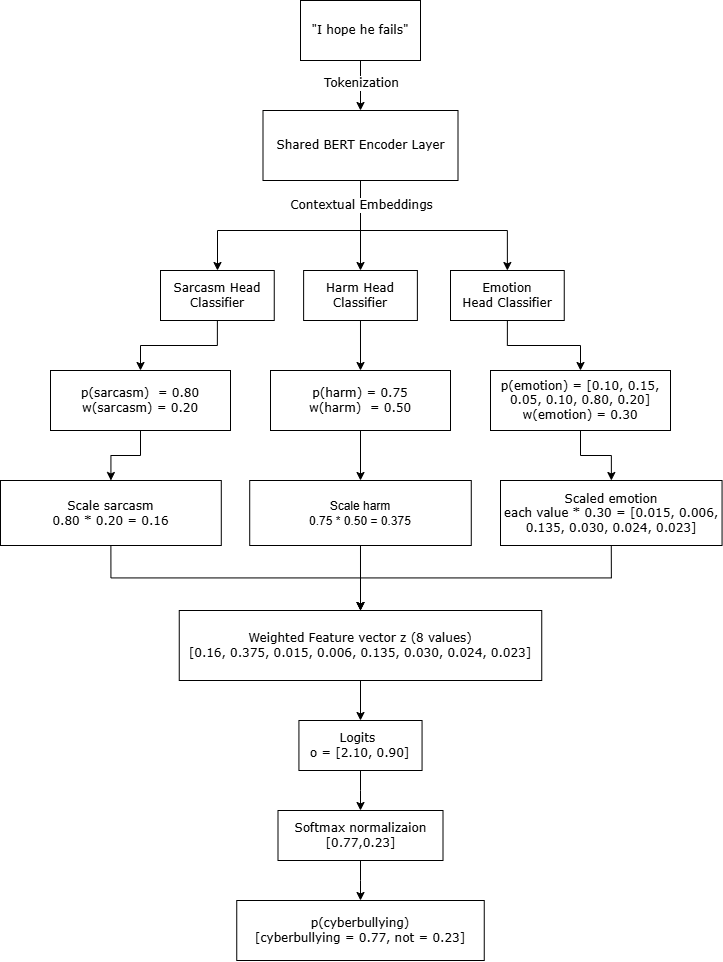
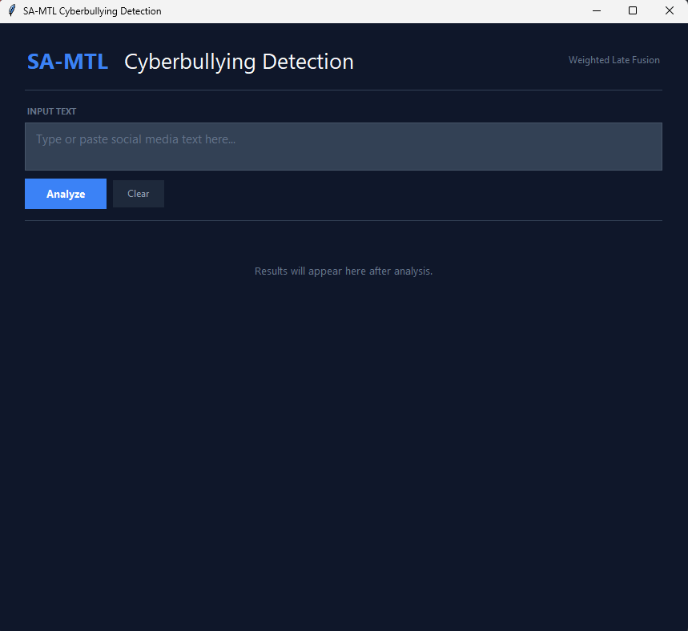
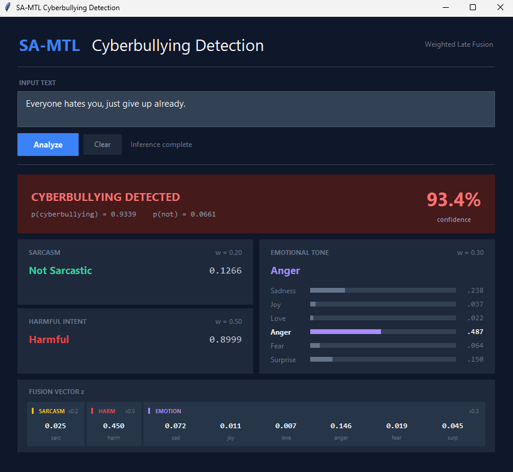

# MTL-BERT: Multi-Task Learning with BERT for Cyberbullying Detection

A multi-task learning framework that leverages shared BERT representations across three auxiliary tasks — sarcasm detection, harm/intent classification, and emotion recognition — to improve cyberbullying detection through weighted late fusion.

## Architecture



## Project Structure

```
mtl-bert/
├── models/
│   ├── mtl_bert.py                    # MTL-BERT (equal weight, unified dataset)
│   ├── mtl_bert_augmented.py          # MTL-BERT + contextual MLM augmentation
│   ├── stl_bert.py                                    # Single-task BERT baselines
│   └── pipeline_baseline.py                           # Sequential pipeline baseline
├── utils/
│   ├── dataset.py            # Data loading & metric computation
│   ├── visualize.py          # Publication-quality figure generation
│   └── attention_viz.py      # Attention distribution visualization
├── inference.py              # Weighted late fusion inference
├── ablation_fusion_weights.py  # Fusion-weight ablation study
├── prototype/
│   └── app.py                # Tkinter GUI for live inference
├── data/
│   ├── cyberbully_train_ready.csv   # Unified multi-label dataset (training-ready)
│   ├── clean_for_training.py        # Raw → unified preprocessing script
│   ├── Cyberbully_corrected_emotion_sentiment.xlsx - cyberbully.csv  # Raw source
│   ├── cyberbullying/               # Raw per-task dataset
│   ├── emotions/                    # Raw per-task dataset
│   └── sarcasm/                     # Raw per-task dataset
├── results/                  # Training results & metrics
├── figures/                  # Generated plots
├── Colab/                    # Colab notebook experiments
├── paper/                    # Thesis document
└── requirements.txt
```

## Models

| Model | Description |
|-------|-------------|
| **MTL-BERT (Equal Weight)** | Multi-task BERT with equal loss weighting across sarcasm, harm, and emotion tasks. Trained on unified dataset with shared encoder. |
| **MTL-BERT (Augmented)** | Same as above + contextual MLM augmentation (15% masking) and class-balanced oversampling for emotion classes. |
| **STL-BERT** | Single-task baseline: one independent BERT model per task. |
| **Pipeline Baseline** | Sequential cascade where sarcasm feeds into harm classification. Tracks Cascade Error Rate (CER). |

## Setup

```bash
pip install -r requirements.txt
```

### Requirements

- Python 3.10+
- PyTorch >= 2.10.0
- Transformers >= 5.1.0
- scikit-learn >= 1.8.0

## Training

Each training script supports multiple seed runs (42, 123, 456) and saves results to `results/`.

```bash
# MTL-BERT (equal weight)
python models/mtl_bert.py

# MTL-BERT with augmentation
python models/mtl_bert_augmented.py

# Single-task baselines
python models/stl_bert.py

# Pipeline baseline
python models/pipeline_baseline.py
```

## Inference

Run inference using the trained MTL-BERT model with weighted late fusion:

```bash
# Default model
python inference.py

# Specify model path
python inference.py --model results/unified-dataset/mtl-equal-weight-one-dataset/mtl_equal_one_dataset_seed456.pt

# Single text
python inference.py --text "I hope he fails"
```

### Fusion Weights

| Task | Weight | Role |
|------|--------|------|
| Harm/Intent | 0.50 | Primary indicator |
| Emotion | 0.30 | Contextual signal |
| Sarcasm | 0.20 | Modifier signal |

## Fusion Weight Ablation

Evaluates how different fusion weight configurations affect cyberbullying classification on the test set, across all 3 seeds. Task head probabilities are computed once per seed and reused across configs to keep runtime cheap.

```bash
python ablation_fusion_weights.py
```

| Config | w_harm | w_sarc | w_emotion | Rationale |
|--------|:------:|:------:|:---------:|-----------|
| F1-Proportional      | 0.40 | 0.37 | 0.24 | Weights ∝ each head's F1 (Table 4.3) |
| Equal                | 0.34 | 0.33 | 0.33 | Neutral reference, no prioritization |
| Harm-Dominant        | 0.60 | 0.20 | 0.20 | Harm is the most direct cyberbullying signal |
| Emotion-Prioritized  | 0.50 | 0.20 | 0.30 | Tests whether affective context helps |
| Sarcasm-Reduced      | 0.50 | 0.10 | 0.40 | Down-weights the weakest head, redistributes to harm/emotion |

Per-seed and aggregated (mean ± std) accuracy, precision, recall, and F1 are written to `results/unified-dataset/fusion-weight-ablation/ablation_results.json`.

## Visualization

```bash
# Generate comparison figures across all models
python utils/visualize.py

# Attention distribution analysis
python utils/attention_viz.py
```

## GUI Prototype

A Tkinter-based desktop app for live cyberbullying detection:

```bash
python prototype/app.py
```

### Screenshots

| Default | Not Cyberbullying | Cyberbullying Detected |
|:-------:|:-----------------:|:----------------------:|
|  |  |  |

The GUI displays:
- **Final prediction** with confidence score
- **Task head outputs** — sarcasm, harm/intent, and emotion probabilities
- **Fusion vector z** — the 8-dim weighted feature vector used for the final decision

## Dataset

Source: [Google Sheets dataset](https://docs.google.com/spreadsheets/d/1tD5yqGZ3TlDjeUFThautfZGegHrRz7FW/edit?gid=1650123160#gid=1650123160)

The unified dataset (`data/cyberbully_train_ready.csv`) contains multi-label annotations with the following columns:

| Column | Type | Values |
|--------|------|--------|
| `text` | string | Input text |
| `cyberbullying` | binary | 0 / 1 |
| `sarcasm` | binary | 0 / 1 |
| `harm` | binary | 0 / 1 |
| `emotion` | categorical | sadness, joy, love, anger, fear, surprise |

Split: 80% train / 10% validation / 10% test
